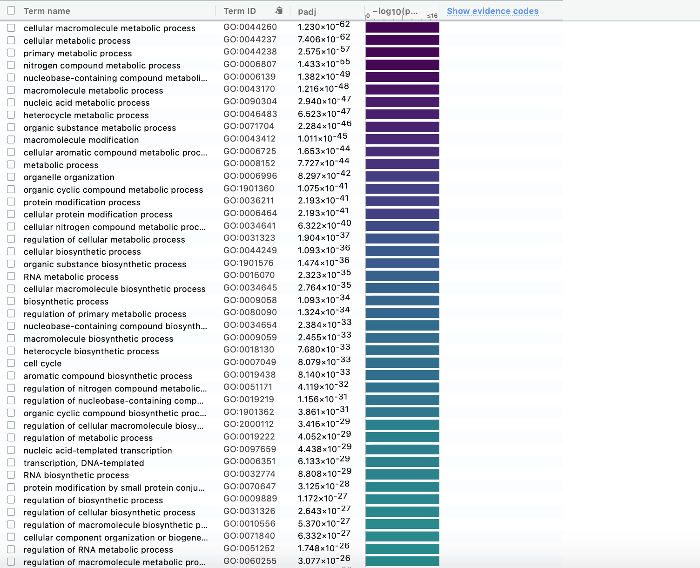
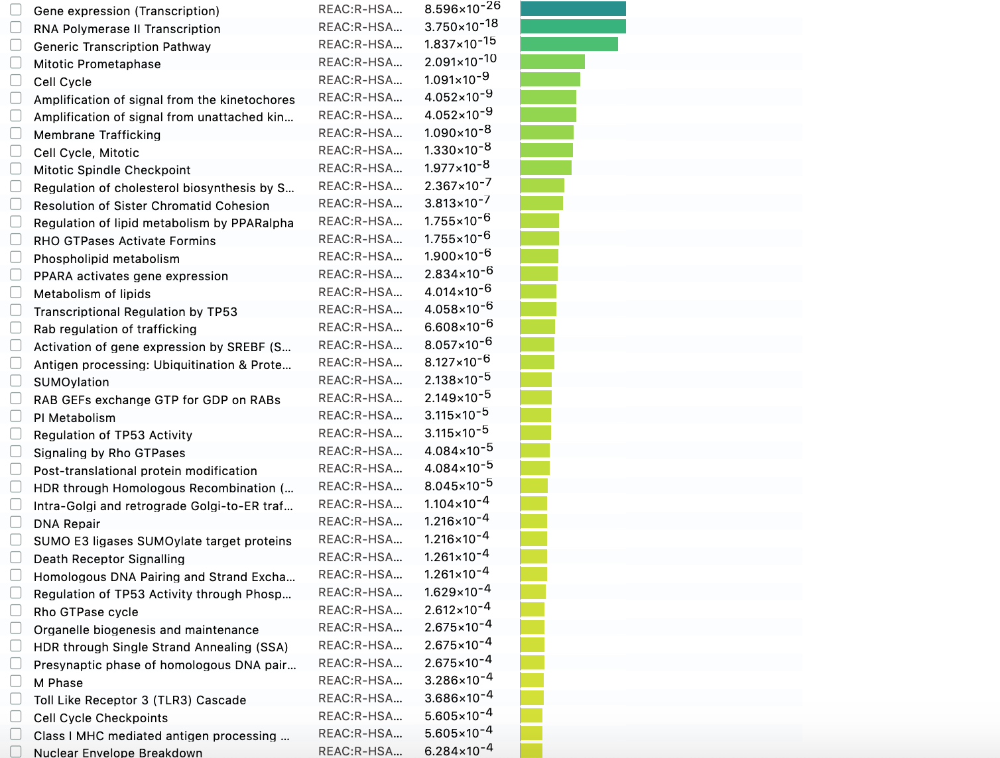
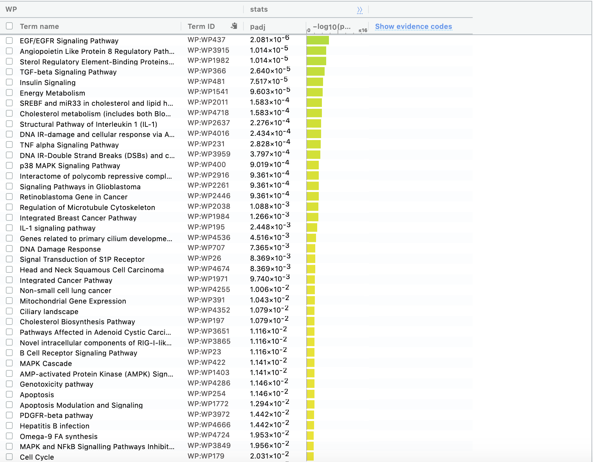
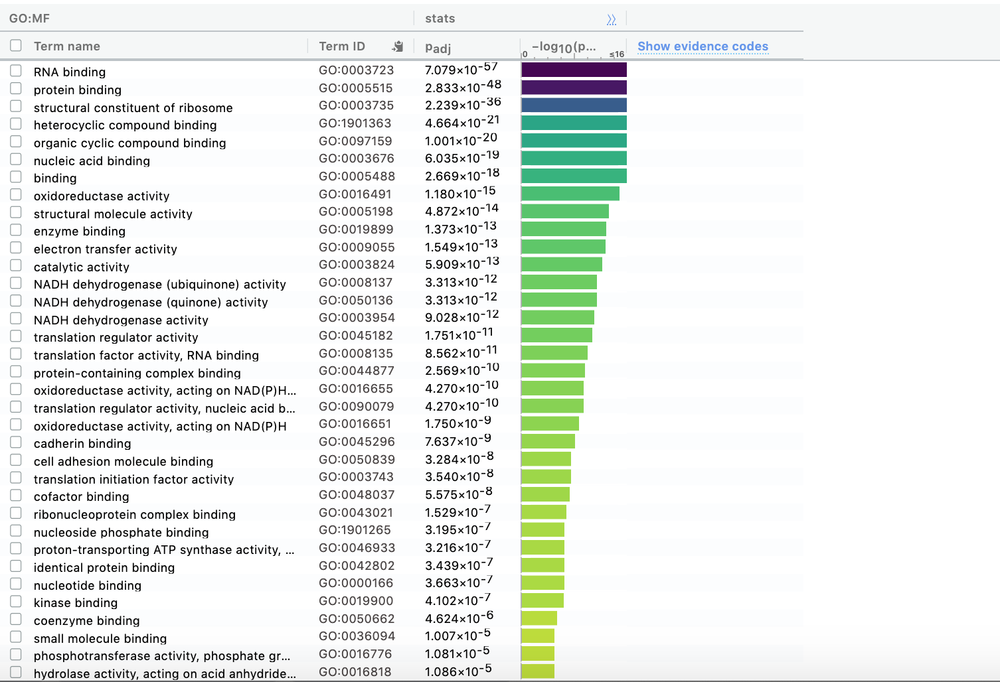
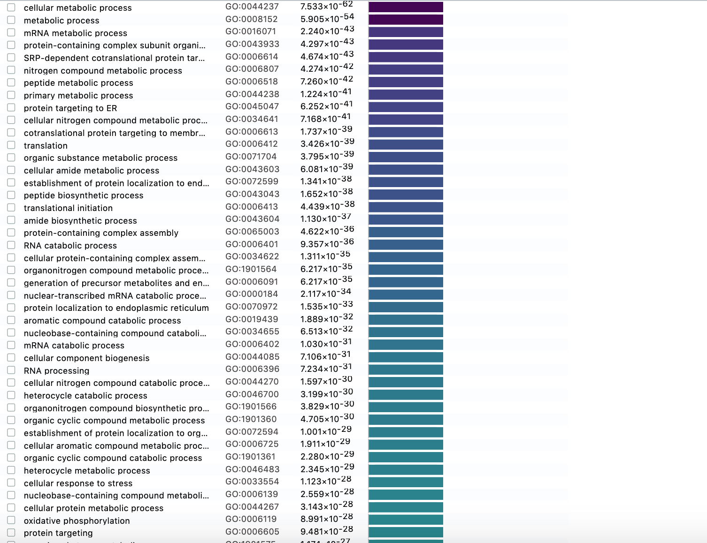
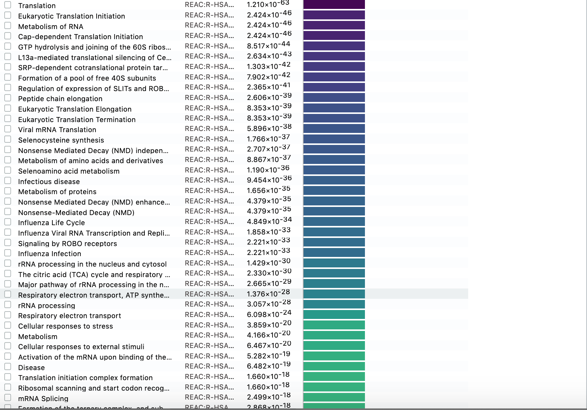

# Material from A1
```{r a1, message=FALSE, warning=FALSE, child='A1t.Rmd', include=FALSE, echo=FALSE, eval=TRUE}

```
Data was from GEO with ID 'GSE72055'


```{r}
library(ComplexHeatmap)
library(circlize)
library(dplyr)
library(magrittr)
library(knitr)
library(kableExtra)
(NormalizedData)
```
# Differential Gene Expression
The MDS Plot from A1
```{r}

plotMDS(d, labels=rownames(samples),
        col = c("gold4","blue")[factor(samples$treatment)])
```


```{r}
normalized_count_data <- NormalizedData
kable(normalized_count_data[1:5,1:5], type="html")

heatmap_matrix <- normalized_count_data[,3:ncol(normalized_count_data)]
rownames(heatmap_matrix) <- normalized_count_data$ensembl_gene_id
colnames(heatmap_matrix) <- colnames(normalized_count_data[,3:ncol(normalized_count_data)])
```


```{r}
limma::plotMDS(heatmap_matrix,
               col = rep(c("darkgreen","blue"),10))

samples <- data.frame(lapply(colnames(normalized_count_data)[3:8],
                             FUN=function(x){unlist(strsplit(x, split = "_"))[c(1,2)]}))
colnames(samples) <- colnames(normalized_count_data)[3:8]
rownames(samples) <- c("treatment","repID") 
samples <- data.frame(t(samples))
samples[1:6,]


```

## Create our data matrix

```{r}
model_design <- model.matrix(~ samples$treatment)
kable(model_design, type="html")

expressionMatrix <- as.matrix(normalized_count_data[,3:8])
rownames(expressionMatrix) <- normalized_count_data$ensembl_gene_id
colnames(expressionMatrix) <- colnames(normalized_count_data)[3:8]
minimalSet <- ExpressionSet(assayData=expressionMatrix)

#Fit our data to the above model
fit <- lmFit(minimalSet, model_design)
```
## Getting the P values

We will be applying empircal Bayes to compute differential expression for the data model we created above to get the P values

```{r}

fit2 <- eBayes(fit,trend=TRUE)
topfit <- topTable(fit2, 
                   coef=ncol(model_design),
                   adjust.method = "BH",
                   number = nrow(expressionMatrix))
#merge hgnc names to topfit table
output_hits <- merge(normalized_count_data[,1:2],
                     topfit,
                     by.y=0,by.x=1,
                     all.y=TRUE)
#sort by pvalue
output_hits <- output_hits[order(output_hits$P.Value),]
kable(output_hits[1:10,],type="html")
```
## How many gene pass the threshold p-value < 0.05 in both the unadjusted and adjusted p-values?
```{r}
length(which(output_hits$P.Value < 0.05))
length(which(output_hits$adj.P.Val < 0.05))
```

```{r}
model_design_pat <- model.matrix(
  ~ samples$repID + samples$treatment)
kable(model_design_pat,type="html")
```

## Finding the Pvalue with a different model using the Limma package
```{r}
#Fit our data to the above model

fit_pat <- lmFit(minimalSet, model_design_pat)
#Apply empircal Bayes to compute differential expression for the above described model.

fit2_pat <- eBayes(fit_pat,trend=TRUE)
topfit_pat <- topTable(fit2_pat, 
                   coef=ncol(model_design_pat),
                   adjust.method = "BH",
                   number = nrow(expressionMatrix))
#merge hgnc names to topfit table
output_hits_pat <- merge(normalized_count_data[,1:2],
                         topfit_pat,by.y=0,by.x=1,all.y=TRUE)
#sort by pvalue
output_hits_pat <- output_hits_pat[order(output_hits_pat$P.Value),]
kable(output_hits_pat[1:10,],type="html")
```

```{r}
#How many gene pass the threshold p-value < 0.05?

length(which(output_hits_pat$P.Value < 0.05))

#How many genes pass correction?

length(which(output_hits_pat$adj.P.Val < 0.05))
```
## Compare the results from the two different models
```{r}


simple_model_pvalues <- data.frame(ensembl_id = output_hits$ensembl_gene_id,
                                   simple_pvalue=output_hits$P.Value)
pat_model_pvalues <-  data.frame(ensembl_id = output_hits_pat$ensembl_gene_id,
                                 replicate_pvalue = output_hits_pat$P.Value)
two_models_pvalues <- merge(simple_model_pvalues,
                            pat_model_pvalues,by.x=1,by.y=1)
two_models_pvalues$colour <- "black"
two_models_pvalues$colour[two_models_pvalues$simple_pvalue<0.05] <- "orange"
two_models_pvalues$colour[two_models_pvalues$replicate_pvalue<0.05] <- "blue"
two_models_pvalues$colour[two_models_pvalues$simple_pvalue<0.05 & two_models_pvalues$replicate_pvalue<0.05] <- "red"
plot(two_models_pvalues$simple_pvalue,two_models_pvalues$replicate_pvalue,
     col = two_models_pvalues$colour,
     xlab = "simple model p-values",
     ylab ="replicate model p-values", 
     main="Simple vs replicate Limma")
```

```{r}
ensembl_of_interest <- normalized_count_data$ensembl_gene_id[
  which(normalized_count_data$hgnc_symbol == "CYP1A1")]
two_models_pvalues$colour <- "grey"
two_models_pvalues$colour[two_models_pvalues$ensembl_id==ensembl_of_interest] <- "red"
plot(two_models_pvalues$simple_pvalue,two_models_pvalues$replicate_pvalue,
     col = two_models_pvalues$colour,
     xlab = "simple model p-values",
     ylab ="replicate model p-values",
      main="Simple vs replicate Limma")
```


--


## Set up our edgeR objects
```{r}


d = DGEList(counts=filtered_data_matrix, group=samples$treatment)

#Estimate Dispersion - our model design.

d <- estimateDisp(d, model_design_pat)

#Fit the model

fit <- glmQLFit(d, model_design_pat)


kable(model_design_pat[1:6,1:4], type="html") %>%
  row_spec(0, angle = -40)

## Calculating the differential expression using the Quasi liklihood model


qlf.pos_vs_neg <- glmQLFTest(fit, coef='samples$treatmentiso12')
kable(topTags(qlf.pos_vs_neg), type="html")
```


```{r}


qlf_output_hits <- topTags(qlf.pos_vs_neg,sort.by = "PValue",
                           n = nrow(normalized_count_data))
#How many gene pass the threshold p-value < 0.05?

length(which(qlf_output_hits$table$PValue < 0.05))

#How many genes pass correction?

length(which(qlf_output_hits$table$FDR < 0.05))

```
## Compare the results from the two different models
```{r}


#Limma vs Quasi liklihood
qlf_pat_model_pvalues <- data.frame(
          ensembl_id = rownames(qlf_output_hits$table),
          qlf_replicate_pvalue=qlf_output_hits$table$PValue)
limma_pat_model_pvalues <-  data.frame(
          ensembl_id = output_hits_pat$ensembl_gene_id,
          limma_replicate_pvalue = output_hits_pat$P.Value)
two_models_pvalues <- merge(qlf_pat_model_pvalues,
                            limma_pat_model_pvalues,
                            by.x=1,by.y=1)
two_models_pvalues$colour <- "black"
two_models_pvalues$colour[two_models_pvalues$qlf_replicate_pvalue<0.05] <- "orange"
two_models_pvalues$colour[two_models_pvalues$limma_replicate_pvalue<0.05] <- "blue"
two_models_pvalues$colour[two_models_pvalues$qlf_replicate_pvalue<0.05 & two_models_pvalues$limma_replicate_pvalue<0.05] <- "red"
plot(two_models_pvalues$qlf_replicate_pvalue,
     two_models_pvalues$limma_replicate_pvalue,
     col = two_models_pvalues$colour,
     xlab = "QLF replicate model p-values",
     ylab ="Limma replicate model p-values",
     main="QLF vs Limma")
```

# MA PLot
```{r}

plotMA(fit2, main="hTR DMSO vs ISO")
```

Differential Gene Expression

Conduct differential expression analysis with your normalized expression set from Assignment #1. Define your model design to be used to calculate differential expression - revisit your MDS plot from Assignment #1 to demonstrate your choice of factors in your model.

Calculate p-values for each of the genes in your expression set. How many genes were significantly differentially expressed? What thresholds did you use and why?
Based of the P values 12739 genes where signifcantly diffentailly expressed

Multiple hypothesis testing - correct your p-values using a multiple hypothesis correction method. Which method did you use? And Why? How many genes passed correction?

I used the Emprical Bayes method, Based of the adjusted P values 12643 genes where signifcantly diffentailly expressed

Based off the adjusted P values 12643 genes where signifcantly diffentailly expressed I used 


# Thresholded over-representation analysis
```{r}
#estimate dispersion
d <- estimateDisp(d, model_design_pat)
#calculate normalization factors
d <- calcNormFactors(d)
#fit model
fit <- glmQLFit(d, model_design_pat)
#calculate differential expression
qlf.pos_vs_neg <- glmQLFTest(fit, coef='samples$treatmentiso12')

qlf_output_hits <- topTags(qlf.pos_vs_neg,sort.by = "PValue",
                           n = nrow(filtered_data_matrix))

length(which(qlf_output_hits$table$PValue < 0.05))

kable(topTags(qlf.pos_vs_neg), type="html")
```

## Upreglauted and downregulated genes
```{r}

#How many genes are up regulated?

length(which(qlf_output_hits$table$PValue < 0.05 
             & qlf_output_hits$table$logFC > 0))

#How many genes are down regulated?

length(which(qlf_output_hits$table$PValue < 0.05 
             & qlf_output_hits$table$logFC < 0))
```
## Threshold number of genes
```{r}
#Create thresholded lists of genes.

#merge essabmle IDs with the top hits
qlf_output_hits_withgn <- merge(tel_exp[,1:2],qlf_output_hits, by.x=1, by.y = 0)
qlf_output_hits_withgn[,"rank"] <- -log(qlf_output_hits_withgn$PValue,base =10) * sign(qlf_output_hits_withgn$logFC)
qlf_output_hits_withgn <- qlf_output_hits_withgn[order(qlf_output_hits_withgn$rank),]

upregulated_genes <- qlf_output_hits_withgn$ID[
  which(qlf_output_hits_withgn$PValue < 0.05 
             & qlf_output_hits_withgn$logFC > 0)]

downregulated_genes <- qlf_output_hits_withgn$ID[
  which(qlf_output_hits_withgn$PValue < 0.05 
             & qlf_output_hits_withgn$logFC < 0)]


write.table(x=upregulated_genes,
            file=file.path("data","tel_exp_upregulated_genes.txt"),sep = "\t",
            row.names = FALSE,col.names = FALSE,quote = FALSE)

write.table(x=downregulated_genes,
            file=file.path("data","tel_exp_downregulated_genes.txt"),sep = "\t",
            row.names = FALSE,col.names = FALSE,quote = FALSE)
```

# Running thresholded gene set enrichment analysis with gProfiler

I ran an analysis of the upregualed genes the downregulated genes and finally all of them together using gprofiler
https://biit.cs.ut.ee/gprofiler/gost


Here are the downregulated gene results




Here are the upregulataed gene results








The upregulated genes seem to to have fewer terms show up with as many hits and when run together the results seem to favor the genes that have been downregulated


Q:Which method did you choose and why?
I used g:profiler since it worked really well with the homework assigment and has a large number of datasets it can pull from
Q:What annotation data did you use and why? What version of the annotation are you using?
I used the following annoted data sets:
GO molecular function
GO biological process
Reactome
WikiPathways

Q:How many genesets were returned with what thresholds?


Do the over-representation results support conclusions or mechanism discussed in the original paper?
These results seem to support the findings in the paper many of the terms that were returned for the downregulated gene sets seeme to invlvoved in RNA regualtion such as RNA Polymerase II Transcription, ATP binding,ribonucleotide binding suggesting that isoginkgetin does indeed mimic the effects of RNA exosome inhibition


# References 

[@tseng_wang_burns_schroeder_gaspari_baumann_2015]


# Code Attempt for Cytoscape and GSEA
```{r}
#install required R and bioconductor packages
tryCatch(expr = { library("RCurl")}, 
         error = function(e) {  install.packages("RCurl")}, 
         finally = library("RCurl"))

#use library
tryCatch(expr = { library("limma")}, 
         error = function(e) { source("https://bioconductor.org/biocLite.R")
           biocLite("limma")}, 
         finally = library("limma"))
tryCatch(expr = { library("Biobase")}, 
         error = function(e) { source("https://bioconductor.org/biocLite.R")
           biocLite("Biobase")}, 
         finally = library("Biobase"))
tryCatch(expr = { library("ggplot2")}, 
         error = function(e) { install.packages("ggplot2")}, 
         finally = library("ggplot2"))

#For creating json and communicating with cytoscape
tryCatch(expr = { library("httr")}, 
         error = function(e) { install.packages("httr")}, 
         finally = library("httr"))
tryCatch(expr = { library("RJSONIO")}, 
         error = function(e) { install.packages("RJSONIO")}, 
         finally = library("RJSONIO"))
```


```{r}
#path to GSEA jar 
# In order to run GSEA automatically you need to speciry the path to the gsea jar file.
#With the latest release of gsea (4.0.2) they no longer release a bundled jar
# and instead release a scriptted way to launch the gsea client.
# specify the java version as 11 if you are using the later version gsea
# the gsea_jar also needs to be the full path to the GSEA 4.0.2 directory that you
# downloaded from GSEA. for example (/Users/johnsmith/GSEA_4.0.2/gsea-cli.sh)
gsea_jar <- "/home/bioc/rstudio/GSEA_4.0.2/gsea-cli.sh"
#java_version <- 11

#Gsea takes a long time to run.  If you have already run GSEA manually or previously there is no need to re-run GSEA.  Make sure the 
# gsea results are in the current directory and the notebook will be able to find them and use them.
run_gsea = TRUE

#navigate to the directory where you put the downloaded protocol files.
working_dir <- getwd()

# leave blank if you want the notebook to discover the gsea directory for itself
#gsea_directory = paste(working_dir,"Mesen_vs_Immuno.GseaPreranked.1497635459262",sep="/") 
#gsea_directory = params$gsea_directory

analysis_name <- "analysis_"
rnk_file <- file.path("data", "tel_exp.rnk")
expression_file <- "expression_file"
classes_file <- "classes_file"
```


```{r}
gmt_url = "http://download.baderlab.org/EM_Genesets/current_release/Human/symbol/"

#list all the files on the server
filenames = getURL(gmt_url)
tc = textConnection(filenames)
contents = readLines(tc)
close(tc)

#get the gmt that has all the pathways and does not include terms inferred from electronic annotations(IEA)
#start with gmt file that has pathways only
rx = gregexpr("(?<=<a href=\")(.*.GOBP_AllPathways_no_GO_iea.*.)(.gmt)(?=\">)",
  contents, perl = TRUE)
gmt_file = unlist(regmatches(contents, rx))

dest_gmt_file <- file.path(working_dir,paste("Supplementary_Table3_",gmt_file,sep="") )

download.file(
    paste(gmt_url,gmt_file,sep=""),
    destfile=dest_gmt_file
)
```


## Attempt at GSEA with Code
```{r}
if(run_gsea){
  
  command <- paste( gsea_jar,  "GSEAPreRanked -gmx", dest_gmt_file, "-rnk" ,file.path(working_dir,rnk_file), 
                   "-collapse true -chip ftp.broadinstitute.org://pub/gsea/annotations_versioned/Human_ENSEMBL_Gene_ID_MSigDB.v7.0.chip -nperm 1000 -scoring_scheme weighted -rpt_label ",analysis_name,
                   "-plot_top_x 120 -rnd_seed 12345  -set_max 200 -set_min 15 -zip_report false -out" ,
                   working_dir, " > gsea_output.txt",sep=" ")
  
  system(command)
  }
```


```{r}
if(gsea_directory == "gsea_jar: /home/bioc/rstudio/GSEA_4.0.2/gsea-cli.sh"){
  gsea_directories <- list.files(path = working_dir, pattern = "\\.GseaPreranked")

  #get the details on the files
  details = file.info(file.path(getwd(),working_dir,gsea_directories))
  #order according to newest to oldest
  details = details[with(details, order(as.POSIXct(mtime),decreasing = TRUE)), ]

  #use the newest file:
  gsea_output_dir <- row.names(details)[1]
} else {
  gsea_output_dir <- gsea_directory
}
```

## Attempt at Cytoscape Code
```{r}
# Basic settings
port.number = 1234
base.url = paste("http://localhost:", toString(port.number), "/v1", sep="")

#print(base.url)

version.url = paste(base.url, "version", sep="/")
cytoscape.open = TRUE

tryCatch(expr = { GET(version.url)}, 
         error = function(e) { return (cytoscape.open = FALSE)}, finally =function(r){ return(cytoscape.open = TRUE)})

```


```{r}
if(!cytoscape.open){
  #try and launch cytoscape
 print("Cytoscape is not open.  Please launch cytoscape.")
} else{
  cytoscape.version =  GET(version.url)
  cy.version = fromJSON(rawToChar(cytoscape.version$content))
  print(cy.version)
  
}
```


