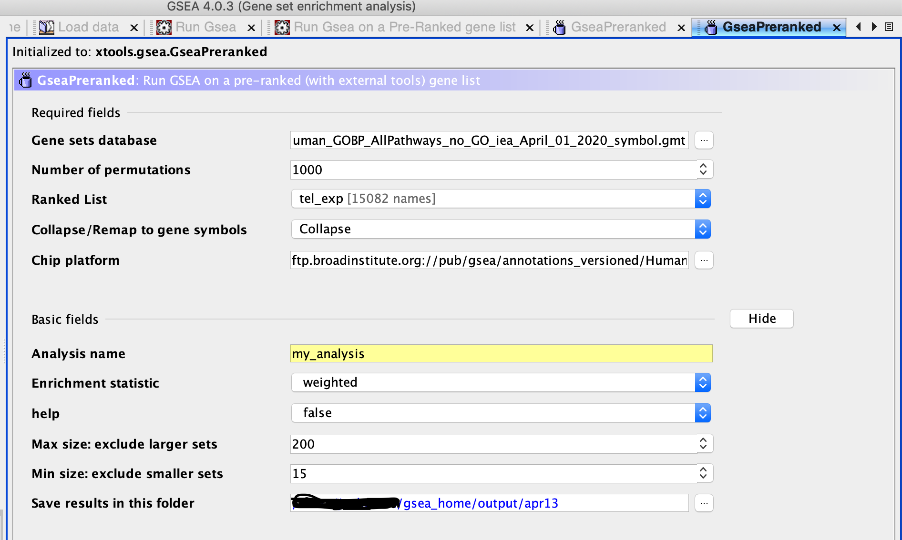
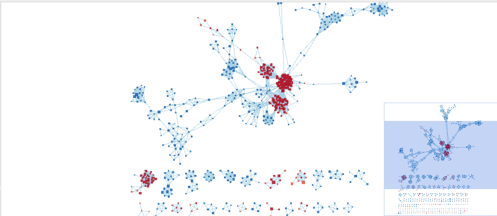
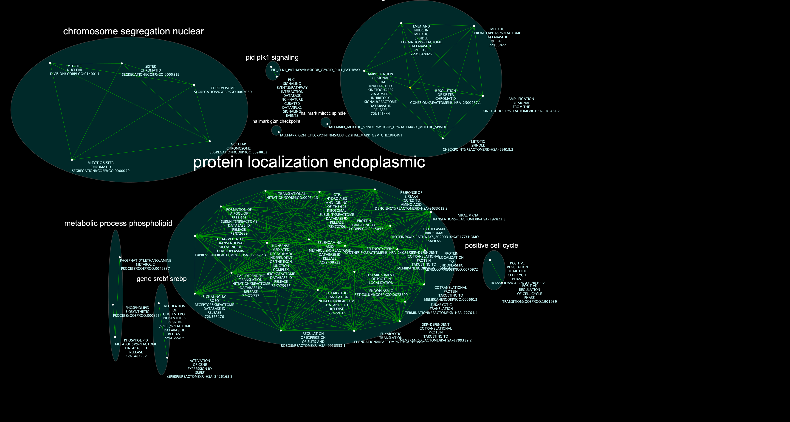
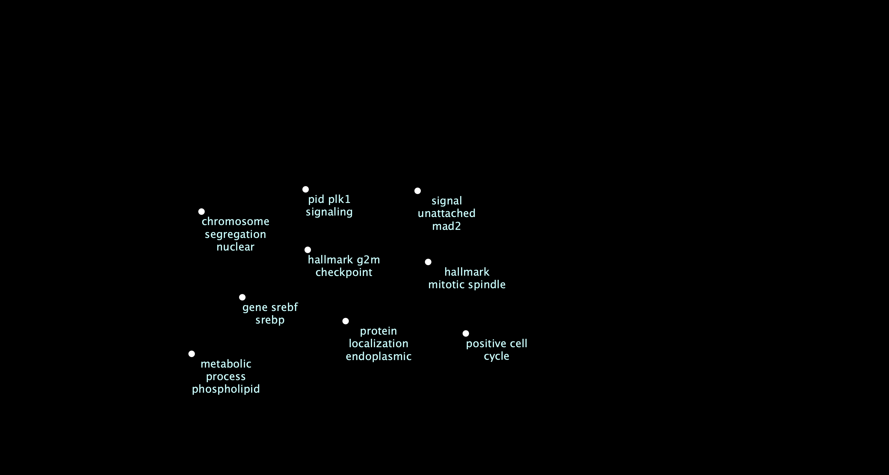
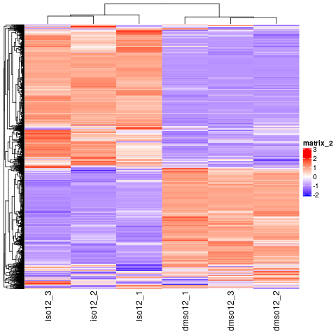

# Packages and Previous Assigments


## A1 and A2
```{r a2, message=FALSE, warning=FALSE, child='A2p.Rmd', include=FALSE}
 
```

```{r}
library(RCurl) 
#install required R and bioconductor packages
tryCatch(expr = { library("RCurl")}, 
         error = function(e) {  install.packages("RCurl")}, 
         finally = library("RCurl"))

#use library
tryCatch(expr = { library("limma")}, 
         error = function(e) { source("https://bioconductor.org/biocLite.R")
           biocLite("limma")}, 
         finally = library("limma"))
tryCatch(expr = { library("Biobase")}, 
         error = function(e) { source("https://bioconductor.org/biocLite.R")
           biocLite("Biobase")}, 
         finally = library("Biobase"))
tryCatch(expr = { library("ggplot2")}, 
         error = function(e) { install.packages("ggplot2")}, 
         finally = library("ggplot2"))

#For creating json and communicating with cytoscape
tryCatch(expr = { library("httr")}, 
         error = function(e) { install.packages("httr")}, 
         finally = library("httr"))
tryCatch(expr = { library("RJSONIO")}, 
         error = function(e) { install.packages("RJSONIO")}, 
         finally = library("RJSONIO"))
if (!requireNamespace("GSAr", quietly = TRUE))
    install.packages("GSA")
if (!requireNamespace("VennDiagram", quietly = TRUE))
    install.packages("VennDiagram")

if (!requireNamespace("futile.logger", quietly = TRUE))
    install.packages("futile.logger")

library(futile.logger)
library(VennDiagram)
library(GSA)
```

# The Start of A3

# Introduction
In the paper "Human telomerase RNA processing and quality control" I took the data set that compared The cells that were treated with DMSO(the control) isoginkgetin treated cells and prepared it for analysis. One of the results of the paper was that isoginkgetin behaves as an RNA exosome inhibitor leaving long telomerase RNA transcripts (htr). In A2 I did both threshold analysis and over representation  analysis to find the genes that were unregulated and down-regulated and what terms seem to show up and are related to these genes.


# Non-thresholded Gene set Enrichment Analysis

## Downloading the geneset
```{r}
gmt_url = "http://download.baderlab.org/EM_Genesets/current_release/Human/symbol/"
# list all the files on the server
filenames = getURL(gmt_url)
tc = textConnection(filenames)
contents = readLines(tc)
close(tc)
# get the gmt that has all the pathways and does not include terms inferred from
# electronic annotations(IEA) start with gmt file that has pathways only
rx = gregexpr("(?<=<a href=\")(.*.GOBP_AllPathways_no_GO_iea.*.)(.gmt)(?=\">)", contents, 
    perl = TRUE)
gmt_file = unlist(regmatches(contents, rx))
dest_gmt_file <- file.path(gmt_file)
download.file(paste(gmt_url, gmt_file, sep = ""), destfile = dest_gmt_file)
```


```{r}
#Creating a rank file
qlf_output_hits_withgn_rank <- qlf_output_hits_withgn[order(qlf_output_hits_withgn$rank, decreasing = TRUE),]

#unrank get to the bottom of this
#gone_file <- qlf_output_hits_withgn_rank[c("ID","rank")]
#qlf_output_hits_withgn_rank$hgnc_symbol[7]<-"nothgnac_ ENSG00000276216"
#somehow didn't have porblem in A1

rank_file <- qlf_output_hits_withgn_rank[c("ID","rank")]

write.table(x=rank_file,
            file=file.path("data","tel_exp.rnk"),sep = "\t",
            row.names = FALSE,col.names = FALSE,quote = FALSE)

```
I had to load the rnk file we created above into GSEA_4.0.3

Afterward we click on RUN GSEA on Pre-Ranked gene list

I put the gmt folder we downloaded into the Gene set database

I put our ranked list in the Ranked list

I had collapase in the next field and then the chip platform was "ftp.broadinstitute.org://pub/gsea/annotations_versioned/Human_ENSEMBL_Gene_ID_MSigDB.v7.0.chip"
to convert my ranked list essamble IDs for GSEA to use(I kept getting errors when I tried anything else)
Max size was set to 200 and everything else was left as default




I used A2/Human_GOBP_AllPathways_no_GO_iea_April_01_2020_symbol.gmt for the data set

## Summary of enrichment results

Enrichment in phenotype: na
1767 / 4857 gene sets are upregulated in phenotype na_pos
569 gene sets are significant at FDR < 25%
397 gene sets are significantly enriched at nominal pvalue < 1%
525 gene sets are significantly enriched at nominal pvalue < 5%

Enrichment in phenotype: na
3090 / 4857 gene sets are upregulated in phenotype na_neg
1186 gene sets are significantly enriched at FDR < 25%
536 gene sets are significantly enriched at nominal pvalue < 1%
926 gene sets are significantly enriched at nominal pvalue < 5%

There are more down-regulated process than up regulated process, but outside of that it is not a strait-forward comparison. The GSEA gave process and returned if they had a fold change or not, In A2 we found pout which genes were up-regulated and which ones were not, although it would make sense that more genes being up or down regulated would imply more process with a positive or negative fold change, processes involve more genes working together and interactions make it so its not a strait forward comparison.In addition when I used g:Profiler in A2 I got terms and these terms or simply what the genes are involved with and not how they affect these process. 

# Visualize your Gene set Enrichment Analysis in Cytoscape

FDR q-value cutoff was set to 0.01.

Here is the inital network without any manual layout

The Network was annottated using the default paramnters as follows
The entire network was annotated and the Label colunm was set to GS_DESCR(The Gene Set Description)

Here is the Publication Ready Figure

Here is the theme network


Many of the themes seen here realte to either to the cell cyle suck a chromosome segragation, hallmakr miotic spindle and the postive cell cyle themes and the others relate to mRNA translation such as protien localization endoplasmic. This fits the model quite well as the telomerase RNA (hTR) is involved in the cell cyle and the inhibition of the RNA exosome will effect protein expression, RNA translation and in genral RNA proceesing and regualtion.

# Interptation 

1.Do the enrichment results support conclusions or mechanism discussed in the original paper? How do these results differ from the results you got from Assignment #2 thresholded methods

The enrichment results appear to support the results from the paper. The GSEA analysis following pathway with positive fold changes Eukaryotic Translation Termination which is very much in line with the results of the paper, a lack of translation would make sense and would support isoginkgetin acting as a RNA exosome inhibition. Another pathway that has a positive fold change is Response Of Eif2ak4 (Gcn2) To Amino Acid Deficiency. Once again if RNA Exosome inhibition is taking place then low levels of RNA degradation would imply low levels of Amino Acids thus this positive fold change of this process would makes sense. The genes of interest that were known parts of the RNA Exomsome are hRRP40(which was down-regulated as expected), DIS3(which did not show significant up-regualtion or down-regulation) and ZCCHC8(which was up-regulated).ANAPC5, one of my up-regulated genes found in A2 promotes anaphase [https://www.genenames.org/data/gene-symbol-report/#!/hgnc_id/HGNC:15713] which somewhat contrast with GSEA results where Mitotic Nuclear Division and Positive Regulation Of Cell Cycle Phase Transition were processes which had a negative fold change.
From the first subnetwork I created using the Default filter for 2.5 3.792 and -2.601 and -2.5 my largest cluster was “gli3 processed degradation”. Gli3 is a zinc finger protein just like ZCCHC8 one of the genes of interest in the paper[https://www.genecards.org/cgi-bin/carddisp.pl?gene=GLI3] [https://www.genenames.org/data/gene-symbol-report/#!/hgnc_id/HGNC:25265]. Gli3 helps regulated gene expression. During RNA exosome inhibition it is possible that gene expression would go down due to the lack of Amino Acids from the RNA transcripts not being broken down. This idea is also supported by the fact Response Of Eif2ak4 (Gcn2) To Amino Acid Deficiency has a positive fold change according to the GSEA results. Thus the process involved in the degradation of a gene expression regulator would make sense and could explain why ZCCHC8 was found to be up-regulated in A2 and would in turn help support the findings of the original paper. Originally the Up-regulation of ZCCHC8 a gene involved in the exosome appeared to contradict the results but the pathway enrihcment analysis made it clear why. Cytoscape helps expand upon the findings in A2 because it goes over the pathways and process involved with the genes and can further elucidate some of the reactions seen. hRRP40(hgnc EXOSC3) is a down-regualted gene in the network it was clustered with protein translation targeting in the subnetwork. 
DIS3 another gene that the paper used to show exosome inhibition was also found to be in the protein cluster in my subnetwork. This differs a bit from the A2 because DIS3 (ENSG00000083520) was not found to be down-regulated or up-regulated and had a rank that was around the middle(7251).

From the Subnetwork I created using the Default filter for 3.3 3.792 and -2.601 and -2.3 the cluster with the largest number of nodes was Protein localization endoplasmic with 22 different nodes, which included pathways such as EUKARYOTIC TRANSLATION TERMINATION, EUKARYOTIC TRANSLATION ELONGATION  and EUKARYOTIC TRANSLATION INITIATION. Pathways I would expect to be involved with longer htR transcripts being built up by lack of degradation via RNA exosome inhibition.

2.Can you find evidence, i.e. publications, to support some of the results that you see. How does this evidence support your result?

"ZCCHC8, the nuclear exosome targeting component, is mutated in familial pulmonary fibrosis and is required for telomerase RNA maturation" it was demonstrated that for htr transcripts to become mature via ZCCHC8, because the exosome is depleted it its possible that ZCCHC8 is up regulated due to more long form htr transcripts accumulating.[@gable_gaysinskaya_atik_talbot_kang_stanley_pugh_amat_codina_schenk_arcasoy_et_al_2019] 


Sometimes the most interesting information is the gene that has no information. In this type of pathway analysis we can only discover what we have already described previously in the literature or pathway databases. Often pathways found in one disease are applicable to other diseases so this technique can be very helpful. It is important to highlight any genes that are significantly differentially expressed in your model but are not annotated to any pathways. We refer to this set of genes as the dark matter.


# Dark Matter
```{r}

gmt_file <- file.path(getwd(),"Human_GOBP_AllPathways_no_GO_iea_April_01_2020_symbol.gmt")
capture.output(genesets<-GSA.read.gmt(gmt_file),file="gsa_load.out")
names(genesets$genesets) <- genesets$geneset.names
```


```{r}
#Quickely fix our expression file
library(biomaRt)
listMarts()
listEnsemblArchives()[1:10,]
ensembl <- useMart("ensembl")
datasets <- listDatasets(ensembl)
kable(head(datasets),format = "html")
kable(head(datasets[grep(datasets$dataset,pattern = "sapiens"),]),format = "html")
ensembl = useDataset("hsapiens_gene_ensembl",mart=ensembl)

biomart_human_filters <- listFilters(ensembl)


conversion_stash <- "tel_exp_conversion.rds"
if(file.exists(conversion_stash)){
  exp_conversion <- readRDS(conversion_stash)
} else {
  exp_conversion <- getBM(attributes = c("ensembl_gene_id","hgnc_symbol"),
                            filters = c("ensembl_gene_id"),
                            values = exp_conversion$ID,
                            mart = ensembl)
  saveRDS(exp_conversion, conversion_stash)
}

nrow(expression) - nrow(exp_conversion)

dim(exp_conversion)


```

```{r}
#Getting the expression data and the rnk file we created
#expression <- read.table(file.path(getwd(),"data","express.txt"), header = TRUE, sep = "\t", quote="\"", stringsAsFactors = FALSE)
expression <- exp_conversion
ranks <- read.table(file.path(getwd(),"data","tel_exp.rnk"), header = TRUE, sep = "\t", quote="\"", stringsAsFactors = FALSE)

```

```{r}
#get all the GSEA directories
gsea_directories <- list.files(path = file.path(getwd(),"data"),
 pattern = "\\.GseaPreranked")
if(length(gsea_directories) == 1){
 gsea_dir <- file.path(getwd(),"data",gsea_directories[1])
 #get the gsea result files
 gsea_results_files <- list.files(path = gsea_dir, pattern = "gsea_report_*.*.xls")
 #there should be 2 gsea results files
 enr_file1 <-read.table(file.path(gsea_dir,gsea_results_files[1]), header = TRUE, sep = "\t", quote="\"", stringsAsFactors = FALSE,row.names=1)
 enr_file2 <-read.table(file.path(gsea_dir,gsea_results_files[1]), header = TRUE, sep = "\t", quote="\"", stringsAsFactors = FALSE,row.names=1)
}

#get the genes from the set of enriched pathway 
all_enr_genesets<- c(rownames(enr_file1), rownames(enr_file2))
genes_enr_gs <- c()
for(i in 1:length(all_enr_genesets)){
 current_geneset <-
unlist(genesets$genesets[which(genesets$geneset.names %in%
all_enr_genesets[i])])
 genes_enr_gs <- union(genes_enr_gs, current_geneset)
}
```

```{r}
FDR_threshold <- 0.01
#get the genes from the set of enriched pathwasy 
all_sig_enr_genesets<- c(rownames(enr_file1)
[which(enr_file1[,"FDR.q.val"]<=FDR_threshold)],
rownames(enr_file2)[which(enr_file2[,"FDR.q.val"]<=FDR_threshold)])
genes_sig_enr_gs <- c()
for(i in 1:length(all_sig_enr_genesets)){
 current_geneset <-unlist(genesets$genesets[which(genesets$geneset.names %in% all_sig_enr_genesets[i])])
 genes_sig_enr_gs <- union(genes_sig_enr_gs, current_geneset)
}

genes_all_gs <- unique(unlist(genesets$genesets))
```

```{r}


A <- genes_all_gs
B <- genes_enr_gs
C <- expression[,2]
png(file.path(getwd(),"data","dark_matter_overlaps.png"))
draw.triple.venn( area1=length(A), area2=length(B), area3 =
length(C), n12 = length(intersect(A,B)), n13=length(intersect(A,C)), n23 = length(intersect(B,C)), n123 = length(intersect(A,intersect(B,C))), category = c("all genesets","all enrichment results","expression"), fill = c("red","green","blue"), cat.col = c("red","green","blue"))
```



```{r}
#Convert back to essambleIds and see which ranked genes have no annotation
genes_no_annotation <- setdiff(expression[,2], genes_all_gs)
exp_out <- expression[which(expression[,2] %in% genes_no_annotation),]
final <- exp_out[,1]
ranked_gene_no_annotation <- ranks[which(ranks[,1] %in% final),]
ranked_gene_no_annotation[1:10,]
dim(ranked_gene_no_annotation)
```
There were only 3253 genes that didn't have an annotation

The first result(BCYRN1) I checked Uniprot here https://www.uniprot.org/uniprot/I7G5M5 and found it only in mice at the Experimental evidence at transcript level with a low annotation score. 

```{r}
ranked_gene_no_annotation <- ranks[which(ranks[,1] %in% final),]
```

```{r}
not_annotated <- ranked_gene_no_annotation[,1]
normalized_count_data <-  NormalizedData[which(NormalizedData[,1] %in% not_annotated),]
kable(normalized_count_data[1:5,1:5], type="html")

heatmap_matrix <- normalized_count_data[,3:ncol(normalized_count_data)]
rownames(heatmap_matrix) <- normalized_count_data$ensembl_gene_id
colnames(heatmap_matrix) <- colnames(normalized_count_data[,3:ncol(normalized_count_data)])
```

## Heatmap of unannotated genes
```{r}

if(min(heatmap_matrix) == 0){
    heatmap_col = colorRamp2(c( 0, max(heatmap_matrix)), c( "white", "red"))
  } else {
    heatmap_col = colorRamp2(c(min(heatmap_matrix), 0, max(heatmap_matrix)), c("blue", "white", "red"))
  }
current_heatmap <- Heatmap(as.matrix(heatmap_matrix),
                               show_row_dend = TRUE,
                               show_column_dend = TRUE, 
                               col=heatmap_col,
                               show_column_names = TRUE, 
                               show_row_names = FALSE,
                               show_heatmap_legend = TRUE
                               )

heatmap_matrix <- t(scale(t(heatmap_matrix)))
if(min(heatmap_matrix) == 0){
    heatmap_col = colorRamp2(c( 0, max(heatmap_matrix)), c( "white", "red"))
  } else {
    heatmap_col = colorRamp2(c(min(heatmap_matrix), 0, max(heatmap_matrix)), c("blue", "white", "red"))
  }
current_heatmap <- Heatmap(as.matrix(heatmap_matrix),
                               show_row_dend = TRUE,
                               show_column_dend = TRUE, 
                               col=heatmap_col,
                               show_column_names = TRUE, 
                               show_row_names = FALSE,
                               show_heatmap_legend = TRUE
                               )
current_heatmap
```

# References

[@tseng_wang_burns_schroeder_gaspari_baumann_2015]
[@hgnc]
[@database]
[@edgeR]
[@limma]
[@GEOmetadb]
[@BiocManager]
[@knitr]
[@GEOmetadb]
[@GSA]
[@RCurl]
[@futilelogger]
[@VennDiagram]
[@Zuguang_Roland]
[@Zuguang_Lei]
[@gable_gaysinskaya_atik_talbot_kang_stanley_pugh_amat_codina_schenk_arcasoy_et_al_2019]
[@uniprot_consortiumeuropean_bioinformatics_instituteprotein_information_resourcesib_swiss_institute_of_bioinformatics_2019]


